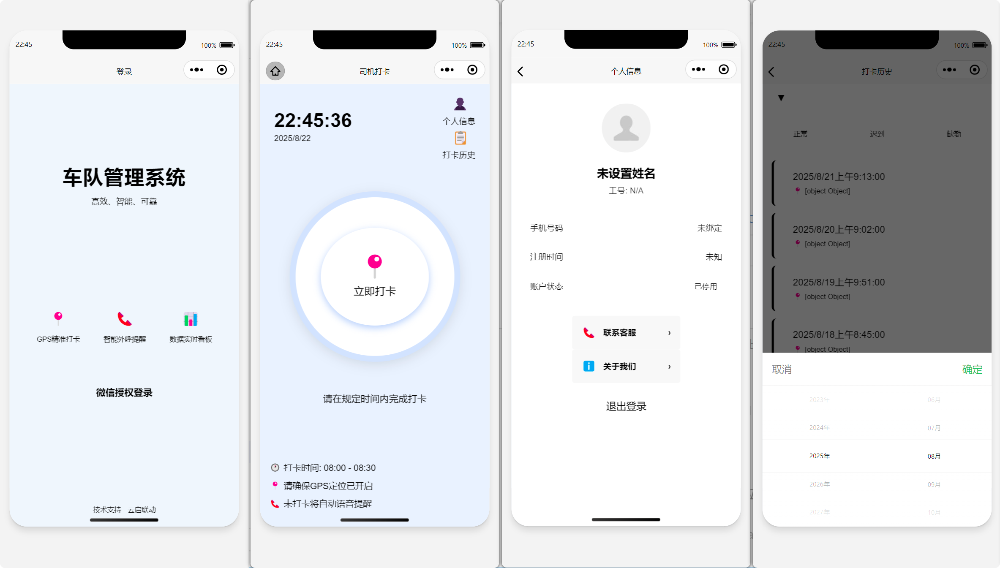

# WeChat Mini Program Example

This repository contains the source code for a WeChat Mini Program example. You can experience it by scanning the Mini Program QR code below.

> **Note:** Please use WeChat Developer Tools or WeChat client version 6.7.2 or higher to run this project.


## Getting Started

To set up and run the project:

1.  Navigate to the `demo` directory:
    ```bash
    cd demo
    ```
2.  Install dependencies for the `demo` directory:
    ```bash
    npm install
    ```
3.  Navigate to the `miniprogram` directory:
    ```bash
    cd miniprogram
    ```
4.  Install dependencies for the `miniprogram` directory:
    ```bash
    npm install
    ```
5.  After completing the above steps, open the project with WeChat Developer Tools and click on `Tools -> Build npm`.

For detailed instructions on setting up the cloud development environment, please refer to the [Cloud Development Example Documentation](https://github.com/wechat-miniprogram/miniprogram-demo/blob/master/miniprogram/page/cloud/README.md).

## Contribution

We welcome contributions to this project! If you encounter any bugs or have suggestions for improvement, please feel free to [open an issue](https://github.com/Tully-L/0819-aiob/issues).

If you wish to contribute code, please submit a Pull Request (PR). To maintain consistent code style, ensure you run the following command in the project root directory before writing code:

```bash
npm install
```

Additionally, please ensure your code passes the Lint checks:
```bash
npm run lint
```

## Screenshots

